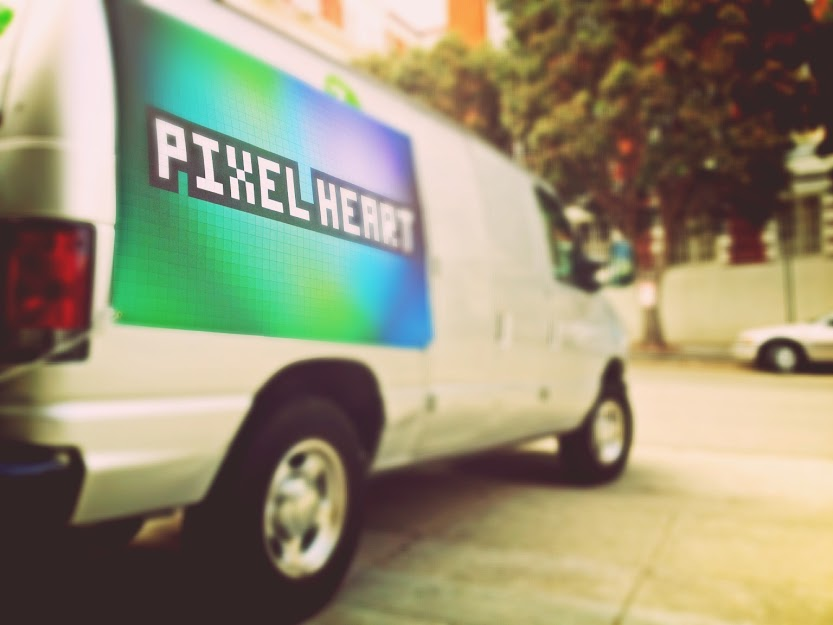

# Pixel Heart at Lightning in a Bottle

> A chapter of featherless' [digital creative history](https://github.com/featherless/digital-creative-history).

- When: July 10 to July 17, 2013
- Where: Southern California, USA

When we brought the Pixel Heart to Lightning in a Bottle we went without any confirmation of where
we'd be able to camp. We had a vehicle pass, but that was it.

Lots of people were already there when we arrived.

We drove around until we eventually found a big empty area at the intersection of two streets. It
looked like someone was setting up camp nearby, so we asked if we could stake some ground.

Turned out it was Gordon Free of Buddha Lounge and he was more than happy to let us camp next to him
once we told him what was in the van.

We set up the Pixel Heart to lean on the van and hooked up our generator out back and we were off!

## Photos

View from beside the Pixel Heart. [Pixel Pusher](https://github.com/thepixelheart/PixelPusher) is
seen here.

Many people took photos dancing in front of the Pixel Heart.

## Videos

# License

This repository and its contents are licensed under [CC BY 2.0](http://creativecommons.org/licenses/by/2.0/).

> A chapter of featherless' [digital creative history](https://github.com/featherless/digital-creative-history).
